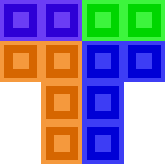
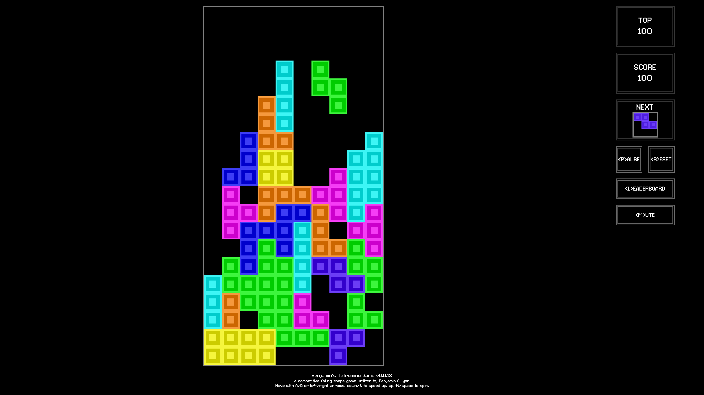

	
	<h1 align="center">tetromino.app</h1>

	
	 
	 
	A game where you try drop tetrominoes in solid rows onto a fixed 10x20 grid, available on mobile and desktop.

<h3 align="center"><em>Play now at <a href="https://tetromino.app">tetromino.app</a> in your browser! Free forever, no monetization, no ads.</em></h3>

### Features

#### Sound

The game makes sound effects using the `AudioContext` API whenever you place a block or score points! Make sure sound is enabled in your browser to try it out. A mute button is provided for those who do not enjoy beeps and/or boops.

#### Competitive leaderboard

After finishing a game with a high score in the top 50, you'll be asked to submit your name to the global leaderboard. The leaderboard is public and is viewable by anyone playing the game!

#### Local high score

The game keeps a record of your top score, so even if you're not competing on the leaderboard you can still play just to beat your personal best.

#### Game replay

When selecting a score from the leaderboard or upon completing a game, you can watch the full replay of the entire game.

#### Works offline

After loading the web page for the first time, the game will always be available in your cache - so even if not connected to the internet you can continue to play.

#### Head-to-head

If you start the game as the same time as a friend, you will both have the exact same pieces for the duration of your game - so you can play an impromptu head-to-head game, even with no internet or connection to the other player.

#### Approachable difficulty

The game is designed to be approachable to casual users, starting at a slow speed. Unlike other block placing games, there are no levels. The speed of the game is based on your current score.

#### Both keyboard and touch support

Whether playing the game on an iPhone with your fingers or playing the game on an ultrawide monitor with a keyboard, the user interface and controls are designed to be as equal as possible on mobile and desktop.

#### Other features

- Play/pause button.
- Animations whenever you score points or lose the game.
- Support for high refresh rate monitors.
- Renders at low resolution to increase performance/battery life.
- Supports being added to your homescreen as an app.

### Privacy notice

Please note that when you complete a game with an active internet connection, your games score will be validated by the server. Upon doing so, the following information will be sent:

- The version of the game you're playing.
- The seed your game was started with.
- The log of your actions during the game.
- The score of your finished game, and how long it took to finish.

This information will be used to verify that your moves during your game produced a valid score, and if so, offer you the ability to submit your score to the leaderboard.

If you choose not submit your game to the leaderboard, this information will be immediately discarded. If you choose to submit your score, the above information and the username given by the user for presenting on the leaderboard will be submitted to the server.

Upon submission, the information will be revalidated, and then the information submitted will be publicly available on the leaderboard. A recording of your game will be accessible to be replayed on the leaderboard by anyone using the game.

No user identifiable information (other than their chosen username) or any information other than listed above is gathered or sent to the server.

Information is only collected to facilitate the leaderboard functionality of the game, and will not be retained or used for any other purpose.

This game does not use any observability, analytics or tracking software.

### Developers

Please see [`DEV.md`](DEV.md) for information about the build system, starting/hacking on the project locally and contributing.